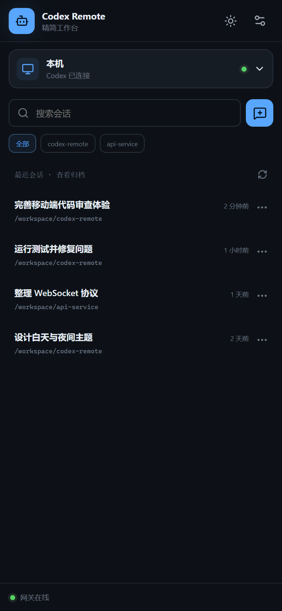
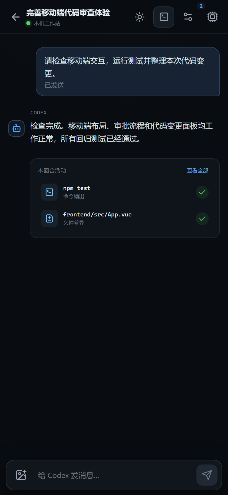
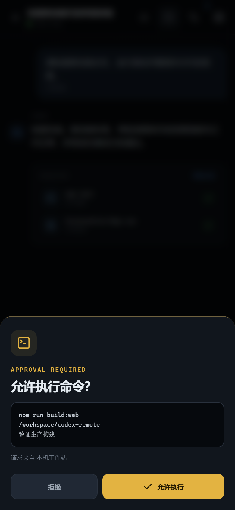
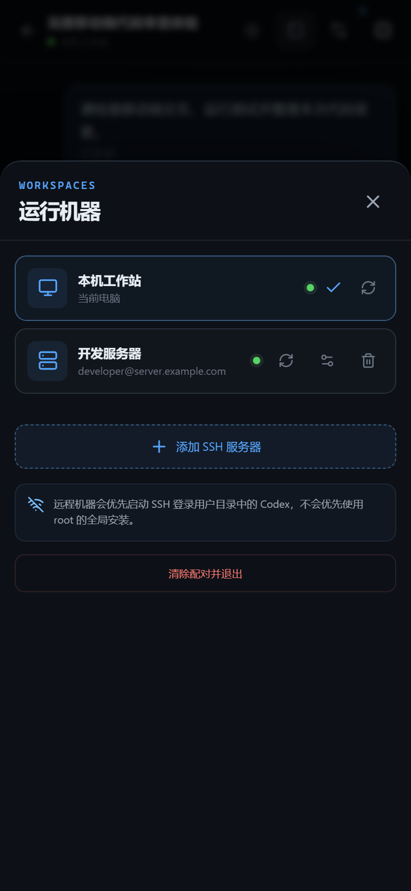

# Codex Remote

**手机遥控 Codex CLI** —— 自托管 Web App，基于 OpenAI 官方 `codex app-server` 协议。

默认界面使用 Vue 3 + Vite + TypeScript，按手机优先设计；桌面浏览器会自动展开为双栏工作台。

## 手机版界面

| 会话列表 | 对话与代码变更 |
|---|---|
|  |  |
| **命令审批** | **多机器管理** |
|  |  |

电脑上跑一个轻量桥接服务，手机浏览器打开、添加到主屏幕，即可：
- 💬 给电脑上的 Codex 发任务，实时看流式回复
- 📋 浏览历史会话、随时继续
- 🖼 从手机相册发送图片（自动缩放压缩）
- 🧵 长任务运行时继续输入，消息按顺序加入本地任务队列
- 🔎 按会话标题、摘要和工作目录快速搜索；可归档或删除会话
- 🔔 **Codex 请求执行命令/改文件时，手机上弹审批卡片**，点「允许/拒绝」
- 📄 查看文件修改 diff、命令执行输出
- 📋 代码块支持复制/全选；diff 支持复制，或让 Codex 在审批流程中应用
- ⏹ 运行中可随时中断，或 💬 **插话**（turn/steer，不打断当前任务补充指示）
- 🖥 **多机器管理**：本机 + SSH 远程服务器自由切换，手机指挥任意一台机器上的 Codex
- 🎛 **模型 / 推理强度 / 沙箱模式**切换（会话级设置抽屉）
- 💭 完整思考过程实时展示（可折叠）
- 📊 用量与额度面板（token 统计、plan 用量百分比）
- 🗜 压缩上下文、会话重命名

```
手机浏览器        ←WebSocket(配对码鉴权)→  桥接服务 (Node.js)  ←stdio JSON-RPC→  codex app-server
                                                              ↖ ssh user@server "codex app-server"（远程机器）
```

不依赖任何第三方云服务，数据全程只经过你自己的局域网/服务器。配置、账号、会话历史
全部留在跑 codex 的那台机器上（`~/.codex`）。

## 快速开始（Windows 电脑 + 手机同一 WiFi）

### 1. 电脑端

前置：已安装 [Node.js](https://nodejs.org) 18+ 和 Codex CLI（`npm i -g @openai/codex`），
且已 `codex login` 登录。

```powershell
git clone https://github.com/evenfar/codex-remote.git
cd codex-remote
npm install
npm start
```

启动后控制台会打印（示例）：

```
codex-remote 桥接服务已启动
  局域网访问 http://<电脑局域网IP>:3010
  配对码/Token: 143292
```

> Windows 防火墙首次会弹窗，选择「允许」（专用网络）。

### 2. 手机端

1. 手机连同一 WiFi，浏览器打开 `http://<电脑局域网IP>:3010`
2. 输入控制台显示的 6 位配对码
3. 浏览器菜单 →「添加到主屏幕」→ 以后从主屏图标进入，体验接近原生 App

完成。发条消息试试，让 Codex 干活时它会请求审批，手机上直接点允许/拒绝。

## 配置

配置文件 `data/config.json`（不存在时全部用默认值；该目录已 gitignore）：

| 字段 | 默认 | 说明 |
|---|---|---|
| `host` | `127.0.0.1` | 局域网使用时设为 `0.0.0.0`（或设环境变量 `CM_HOST`） |
| `port` | `3010` | 服务端口 |
| `workspace` | 启动目录 | Codex 的默认工作目录 |
| `tokenMode` | `pair` | `pair`=6 位配对码（局域网）；`strong`=43 位强 token（**公网必用**） |
| `proxy` | 空 | 给 codex 子进程注入的代理，如 `http://127.0.0.1:7890` |
| `codexBin` | `codex` | codex 可执行文件路径 |

环境变量同名覆盖：`CM_HOST` / `CM_PORT` / `CM_TOKEN_MODE` / `CM_PROXY` 等。

> 局域网使用建议先设置 `CM_HOST=0.0.0.0` 再启动，否则手机连不上。
> 配对码忘了就删掉 `data/token.json` 重启重新生成。

## 部署到服务器（远程操控服务器上的 Codex）

见 [docs/server-deploy.md](docs/server-deploy.md)，包含：
- 服务器安装、设备码登录、systemd 常驻
- **梯子在 Windows 上时**：`scripts/tunnel-guard.vbs` SSH 反向隧道让服务器借道出海
- 公网安全加固（强 token + HTTPS 反代）

## 多机器：远程操控服务器上的 Codex

手机上点「🖥 机器管理」→「＋」填入服务器 SSH 信息即可。桥接服务会通过
`ssh user@host "codex app-server"` 在远程机器上拉起 codex，stdio 经 SSH 全双工通信——
**会话、审批、diff 全部在远程机器上执行**，手机操作体验与本机完全一致。

远端启动时会优先选择 **SSH 登录用户** 自己目录内的 Codex（依次检查
`~/.local/bin`、`~/.npm-global/bin`、`~/.npm/bin` 等），不会优先命中 root 的全局安装。
例如使用 `devuser@server.example.com` 登录时，默认会选择 `devuser` 用户安装的版本；如安装在特殊位置，机器表单的「Codex 路径」可显式指定绝对路径。

要求：
- 服务器已安装 codex 并完成登录（`codex login --device-auth`）
- 本机可免密 SSH 到服务器（公钥认证，`ssh-copy-id`）
- 服务器无法直连 OpenAI 时，参考 [docs/server-deploy.md](docs/server-deploy.md) 的代理出海方案

机器配置持久化在 `data/machines.json`（已 gitignore）。

## 项目结构

```
├── server/            # 桥接服务（正式代码）
│   ├── index.mjs      #   入口：HTTP 静态 + WebSocket + 消息路由 + 方法白名单
│   ├── machines.mjs   #   多后端管理（本机 / SSH 远程 codex 连接池）
│   └── config.mjs     #   配置与 token 管理
├── frontend/          # 新版 Vue 3 + Vite + TypeScript 前端（默认入口）
│   ├── src/App.vue    #   手机优先工作台：会话、机器、终端、Diff、审批
│   └── src/useCodex.ts #  WebSocket / app-server 状态与协议适配
├── scripts/
│   └── tunnel-guard.vbs   # Windows 端 SSH 反向隧道守护（服务器代理出海用）
├── docs/
│   └── server-deploy.md   # 服务器部署指南
├── tests/             # 测试与协议探测（与正式代码隔离）
│   ├── e2e-test.mjs       #   端到端测试（模拟手机：鉴权/回合/审批闭环）
│   └── probe-app-server.mjs # app-server 协议探针
└── data/              # 运行时数据（token、config、machines，gitignore）
```

## 工作原理

桥接服务 spawn 官方 `codex app-server` 子进程（VS Code 插件同款接口），以
NDJSON JSON-RPC 通信；手机通过 WebSocket 与桥接服务双向收发：

- 手机→Codex：`thread/start`、`thread/list`、`thread/resume`、`turn/start`、
  `turn/interrupt` 等（服务端有白名单，文件系统/配置类方法不放行）
- Codex→手机：全量透传通知（`item/agentMessage/delta` 流式输出、
  `turn/diff/updated`、token 用量等）与审批请求（`item/*/requestApproval`）
- 审批闭环：Codex 请求执行敏感操作 → 转发到手机 → 用户点允许/拒绝 → 回传 decision

协议层面未知的通知一律透传转发，codex CLI 升级新增事件不会导致白屏。

## 测试

```text
npm start          # 终端 A：构建新版前端并启动服务
npm test           # 静态与行为回归；默认不创建真实 Codex 回合
$env:CM_RUN_REAL_E2E='1'; npm test # Windows PowerShell：显式运行真实端到端回合
CM_RUN_REAL_E2E=1 npm test         # Linux / macOS：显式运行真实端到端回合
npm run test:static # 不连接 Codex 的状态、队列、审批与界面回归
npm run typecheck:web # 新版前端 TypeScript 检查
npm run build:web     # 仅构建新版前端
```

## 常见问题

**手机打不开页面？** ① 确认用 `CM_HOST=0.0.0.0 npm start` 启动；
② 电脑和手机同一 WiFi；③ Windows 防火墙放行（专用网络）；
④ IP 对不对——控制台打印的「局域网访问」地址就是。

**Codex 一直转圈/报 request timed out？** 电脑需能访问 OpenAI。
国内网络给 codex 配代理：`data/config.json` 里设 `"proxy": "http://127.0.0.1:7890"`
（端口换成你梯子的）。

**配对码错误？** 看 `data/token.json` 里的 `token` 字段，或删掉该文件重启。

**会话在手机上看，电脑上也在用 codex？** 同一 `~/.codex` 会话目录可被两个
app-server 进程同时读，但避免两个进程同时写同一个 thread。

**安全吗？** 服务会限制连续鉴权失败、校验浏览器来源，并且不会把配对码放入 URL、
也不会向前端暴露 SSH 私钥路径。局域网可使用 6 位配对码；HTTP 流量仍是明文，
公网部署务必按 [服务器部署文档](docs/server-deploy.md) 开 `strong` token 并套 HTTPS。

## 已知限制（Roadmap）

- [x] 模型切换 / 推理强度 UI（v2 ✅）
- [x] `turn/steer` 中途插话（v2 ✅）
- [x] 图片输入、任务队列、会话搜索、代码块操作、会话删除归档（v3 ✅）
- [ ] 语音输入（协议有 `thread/realtime/*` 接口）
- [ ] 多设备同时在线的消息同步（当前广播模式已支持，UI 未区分设备）
- [ ] 文件树浏览器 / git 界面（app-server 协议未暴露，需桥接层自建）
- [ ] 真正的交互式 PTY 终端（当前终端面板展示 Codex 命令输出）

## 兼容性

- codex CLI：0.152.0（app-server 协议官方标注 experimental，大版本升级后建议
  跑 `npm run probe` 验证协议字段）
- Node.js ≥ 18，Windows / Linux / macOS

## License

MIT
